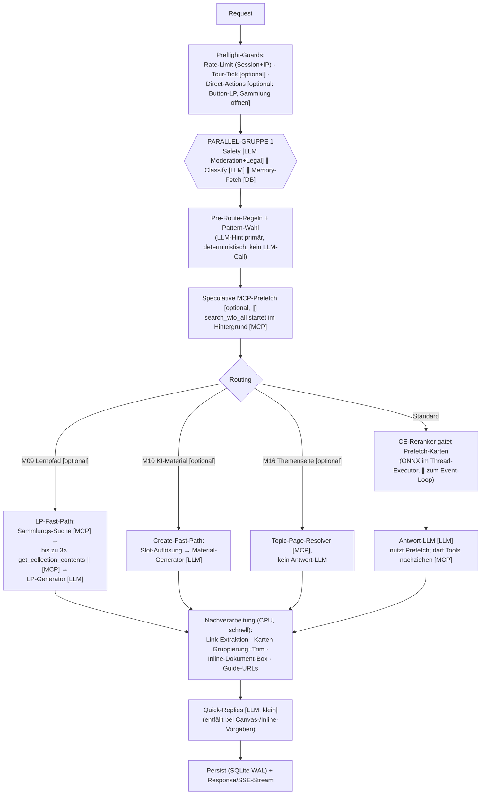

# 06 — Request-Pipeline: Was passiert wann (und was läuft parallel)

> Stand 2026-06-10. Dieses Dokument beschreibt den **zeitlichen Ablauf** eines
> Chat-Turns — vom Backend-Start über die User-Eingabe bis zur Antwort —
> inklusive der Parallelisierungen und aller **optionalen** Schritte.
> Architektur/Elemente: siehe [02-architektur.md](02-architektur.md) und
> [03-elemente.md](03-elemente.md). Live-Messung pro Turn: Studio → *Analyse*
> (Trace pro Session) bzw. Studio → *Lasttest* (Skalierungs-Kurve).

Legende: `∥` = läuft parallel · `[optional]` = nur unter Bedingung aktiv ·
`[LLM]` = bezahlter LLM-Call (B-API) · `[MCP]` = WLO-Suchdienst-Call.

---

## 1. Backend-Start (einmalig)

Beim Start (`uvicorn app.main:app`) blockiert nichts den ersten Request —
fünf Warmups laufen als Hintergrund-Tasks **parallel** an:

| ∥ Task | Zweck | ohne Warmup |
| --- | --- | --- |
| `_embed_seed_chunks` | RAG-Seed-Wissen einbetten | erster RAG-Turn langsamer |
| `_warmup_configs` | YAML/MD-Configs in die mtime-Caches laden | erster Turn parst Configs |
| `_warmup_llm` | LLM-Client/Verbindung anwärmen | erster LLM-Call zahlt TLS/Init |
| `_warmup_reranker` | ONNX-Cross-Encoder laden (~300 MB RAM) | erste Suche lädt das Modell |
| `_prewarm_vocab` | WLO-Vokabulare (Fächer/Typen) vom MCP cachen | erste Suche zahlt Vokabular-Roundtrips |

`/health` antwortet sofort (Docker-Healthcheck soll nicht auf Warmups warten).

---

## 2. Chat-Start im Widget (Seite lädt)

1. Widget-Bundle wird von `backend/widget_dist` ausgeliefert (statisch).
2. `GET /api/config/guide-mode` — öffentliche Display-Flags für den Host.
3. `[optional]` Session-Restore: `GET /api/sessions/{id}/messages`, wenn die
   Seite eine bekannte Session-ID mitbringt.
4. Begrüßung/Quick-Replies kommen aus der Konfiguration — **kein LLM-Call,
   bevor der User etwas eingibt.**

---

## 3. Ein User-Turn — der Hauptpfad (`POST /api/chat` bzw. `/api/chat/stream`)

### Die Schritte im Detail

| # | Schritt | Art | Bedingung / Anmerkung |
| --- | --- | --- | --- |
| 1 | **Rate-Limit** | CPU | Sliding-Window pro Session + IP (`safety-config.yaml`); IP via `_peer_ip` (X-Forwarded-For nur mit `TRUST_FORWARDED_FOR=1`) |
| 2 | **Web-Tour-Tick** | CPU | `[optional]` nur wenn die Session in der Tour-State-Machine steckt — deterministisch, kein LLM |
| 3 | **Direct-Actions** | gemischt | `[optional]` Button-Flows (`generate_learning_path`, `browse_collection`) antworten früh und überspringen 4–10 |
| 4 | **Parallel-Gruppe 1** | 2×LLM ∥ DB | **Safety** (B-API-Moderation + Legal-Check) ∥ **Classify** (Persona/Intent/State/Entities/Signale/Tool-Hint) ∥ **Memory-Fetch**. Regex-Krisen-Gate kann Classify komplett kurzschließen (M01 sofort) |
| 5 | **Pre-Route + Pattern-Wahl** | CPU | YAML-Regeln (z. B. Themenseiten-Kontext) + LLM-Hint-Primary → `winner` |
| 6 | **Speculative Prefetch** | MCP ∥ | `[optional]` bei Such-Intents mit Anker: `search_wlo_all` startet, **bevor** das Antwort-LLM läuft; bei LP-/Create-Route übersprungen bzw. gecancelt |
| 7a | **LP-Fast-Path (M09)** | MCP+LLM | `[optional]` Sammlungs-Suche → bis zu 3 Sammlungs-Inhalte **parallel** (seit 2026-06-10) → ggf. Content-Fallback → LP-Generator-LLM |
| 7b | **Create-Fast-Path (M10)** | LLM | `[optional]` Topic/Typ-Auflösung, Degradation zur Rückfrage, Material-Generator |
| 7c | **M16 Themenseiten-Ansicht** | MCP | `[optional]` baut Swimlanes deterministisch, Antwort-LLM entfällt |
| 8 | **CE-Reranker** | CPU (Thread) | gatet/sortiert Prefetch-Karten; ONNX läuft im Executor — Event-Loop bleibt frei für andere Sessions |
| 9 | **Antwort-LLM** | LLM | System-Prompt stabil gehalten (Prompt-Cache-fähig); nutzt Prefetch-Payloads, darf fehlende Tools selbst nachrufen |
| 10 | **Nachverarbeitung** | CPU | Link-Extraktion (M09: Erwähnungen bleiben als Text), Gruppen-Trim (`display-rules.yaml`), Inline-Dokument-Box, Lotsen-URLs |
| 11 | **Quick-Replies** | LLM klein | **pro Pattern steuerbar** (`quick_replies_mode` im Pattern-Editor): `exact` = nach der Hauptantwort (Default) · `speculative` = parallel zum Antwort-LLM (kennt Pattern/Entities/Prefetch-Treffer; deterministisches Konsistenz-Gate, bei unerwarteter Rückfrage Fallback auf exact) → spart die ~1–3 s QR-Endlatenz · `none` = kein Generator + kein Auto-Followup (System-QRs wie Slot-Optionen/Tour/Lotse bleiben). Anzahl pro Pattern via `quick_replies_max` (leer = global). Liefert die Antwort Inline-QRs (`respond_to_user`), haben diese Vorrang; ein laufender Spec-Task wird gecancelt. |
| 12 | **Persist + Antwort** | DB | SQLite (WAL); bei `/stream` laufen Token schon ab Schritt 9 als SSE zum Widget |

**Latenz-Anatomie eines Such-Turns:** Parallel-Gruppe 1 (~1–2 s, von Classify
dominiert) → Antwort-LLM (~2–6 s, Prefetch macht Tool-Schleifen selten) →
QR (~0,5–1 s). Beim Lernpfad dominiert der Generator-Call (~8–15 s); die
Sammlungs-Fetches davor kosten seit der Parallelisierung nur noch einen
statt bis zu drei MCP-Roundtrips.

---

## 4. Optionale Nebenpfade (nicht im Chat-Hot-Path)

| Pfad | Endpoint | Aktiv wenn | Kosten |
| --- | --- | --- | --- |
| **Sprache → Text (STT)** | `POST /api/speech/transcribe` | User nutzt Mikro **und** `speech_enabled()`: OpenAI-Key vorhanden *oder* B-API mit `B_API_AUDIO=1` | pro Aufnahme |
| **Text → Sprache (TTS)** | `POST /api/speech/tts` | Vorlese-Button bzw. Auto-Speak; gleiche Opt-in-Logik | pro Vorlesen |
| Audio deaktiviert | — | ohne Opt-in: **503 vor jedem Upstream-Call** → keine stillen Kosten | 0 |
| **Eval/Golden-Runs** | `/api/eval/*` | manuell im Studio gestartet | simulierte Dialoge [LLM] |
| **Lasttest** | `/api/loadtest/*` | manuell im Studio gestartet | echte Pipeline-Requests [LLM+MCP] |

---

## 5. Skalierung

### 5.1 Wo die Grenzen liegen

Der Bot ist **I/O-gebunden**: Fast die gesamte Turn-Zeit wartet auf B-API
(LLM) und MCP (Suche). Ein einzelner async-Uvicorn-Prozess hält darum
problemlos dutzende gleichzeitige Turns — lokal nennenswerte CPU brauchen nur
der ONNX-Reranker (läuft im Thread-Pool) und das Markdown-Postprocessing.
Praktisch limitiert zuerst das **Rate-/Kapazitäts-Limit der B-API**, nicht der
eigene Server. Die echte Kurve für die eigene Hardware liefert der
**Studio-Lasttest** (Latenz/Fehler vs. Parallelität + CPU/RAM-Verlauf samt
Fazit „stabil bis N gleichzeitige Nutzer").

Zwei Parallelitäts-Deckel sind dafür per Env steuerbar (2026-06-10):
`LLM_MAX_CONCURRENCY` (Default 20 — Bulkhead vor der B-API, glättet p95
unter Burst statt 429-Lawinen; gemeinsamer Pool für Chat/Moderation/
Embedding) und `MCP_MAX_CONNECTIONS` (Default 50 — vorher deckelte ein
20er-Pool die Suche clientseitig). Auf Linux nutzt Uvicorn automatisch
**uvloop** (in requirements.txt, plattform-markiert) für einen schnelleren
Event-Loop.

> **Hinweis zu `LLM_MAX_CONCURRENCY`:** Der optimale Wert ist
> **provider-/modellabhängig** — B-API-Staging, B-API-Prod und native
> OpenAI haben je eigene Concurrency-/Rate-Limits. Zu hoch gesetzt
> erzeugt 429/504 beim Provider (Retries verstärken die Last), zu
> niedrig nur unnötige Client-seitige Queue-Latenz. Beim Wechsel der
> Provider-/Modell-Kombination neu kalibrieren — am einfachsten mit
> `scripts/probe_b_api_ratelimit.py` (höchste Stufe mit 100 % OK). Für
> Lasttests den Wert ≥ Test-Concurrency setzen, sonst misst man den
> eigenen Bulkhead statt des Providers.
>
> **Messung Staging `b-api-openai` / `gpt-5.4-mini` (2026-06-15)** via
> `scripts/probe_b_api_ratelimit_staging_openai.py`: Burst-Stufen
> 1/3/5/8/12/16/20/24/32 → **alle 100 % OK, keine Drosselung bis 32**
> (Test-Maximum), keine `X-RateLimit-*`-Header; OK-Latenz steigt graceful
> (p50 ~200 ms @3 → ~680 ms @32), kein Cliff. Heißt: die Provider-Seite
> ist bis ≥ 32 **nicht** der Engpass, `LLM_MAX_CONCURRENCY=20` ist
> komfortabel sicher. ACHTUNG — der Probe feuert *minimale* Calls
> (kurzer tool-loser Prompt, `verbosity=low`); echte Turns sind schwerer
> (großer Classify-/Response-Prompt + Tools), belegen die Verbindung
> länger und kosten mehr. Der real bindende Faktor bleibt damit die
> eigene Box (CPU/RAM, Reranker) bzw. die Pro-Turn-Belegung, nicht das
> B-API-Limit — das misst erst der volle Studio-Lasttest. Prod
> (`academiccloud`) separat mit `scripts/probe_b_api_ratelimit.py` prüfen.

Dazu kommt `LLM_READ_TIMEOUT` (Default 75 s, 2026-06-11): hängt ein
LLM-Backend-Knoten, bricht der Client nach 75 s ab und der OpenAI-SDK-Retry
setzt neu an — schneller als das Staging-Gateway, das hängende Calls erst
nach ~120 s mit 504 kappt. Das Widget passt dazu: nach 100 s ohne
SSE-Fortschritts-Event (75 s + Retry-Puffer; Keepalives zählen nicht)
bricht es den Stream ab und zeigt eine ehrliche „dauert gerade
ungewöhnlich lange"-Meldung statt eines endlosen Spinners — bewusst OHNE
den stillen Fallback auf `POST /chat`, der die Wartezeit verdoppeln würde.
Die serverseitig fertig generierte Antwort landet trotzdem im Verlauf.

### 5.2 Rate-Limiter bei mehreren Workern — Redis ist NICHT die einzige Lösung

Der mitgelieferte Limiter ist in-memory und damit **pro Prozess** korrekt.
Optionen nach Ausbaustufe:

1. **Ein Prozess (Status quo, empfohlen bis auf Weiteres):** alles korrekt,
   nichts zu tun. Async trägt weit; vertikal skalieren (mehr RAM/CPU) reicht
   für den WLO-Widget-Traffic voraussichtlich lange.
2. **Mehrere Worker auf EINEM Host — Bordmittel A (Reverse-Proxy):**
   `nginx limit_req` (bzw. Caddy/Traefik-Äquivalent) vor dem Backend
   limitiert pro IP, bevor Requests die App erreichen. Der App-Limiter
   bleibt als Defense-in-Depth (pro Session weiterhin korrekt, pro IP dann
   ~Worker-Anzahl-fach weicher).
3. **Mehrere Worker auf EINEM Host — Bordmittel B (SQLite):** der Limiter
   kann sein Fenster statt in-memory in der vorhandenen SQLite-DB führen
   (eine kleine Tabelle, WAL erlaubt parallele Leser; kleiner Umbau in
   `rate_limiter.py`). Kein neuer Dienst nötig.
4. **Mehrere Hosts:** erst hier braucht es einen geteilten Store (Redis o. Ä.)
   — zusammen mit Sticky-Sessions oder zentralem Session-State, denn auch
   SQLite-Sessions und die mtime-Config-Caches sind hostlokal.

### 5.3 Übrige Prozess-lokale Zustände (relevant ab Multi-Worker)

| Zustand | Multi-Worker-Folge | Einordnung |
| --- | --- | --- |
| SQLite `badboerdi.db` | mehrere Prozesse auf einem Host: ok (WAL); mehrere Hosts: nein | bei Multi-Host auf Server-DB wechseln |
| Config-mtime-Caches | je Worker eigener Cache | unkritisch (Quelle ist das Dateisystem) |
| MCP-Tool-Cache, `_BG_TASKS` | je Worker eigene Instanz | unkritisch |
| Eval-/Lasttest-„ein Run gleichzeitig" | Guard ist DB-/Datei-basiert | funktioniert auch mit mehreren Workern auf einem Host |

### 5.4 Deployment-Checkliste Produktion

- `STUDIO_PASSWORD` setzen (sonst Studio offen — Dev-Default).
- `CORS_ORIGINS` auf die WLO-Hosts einschränken.
- `TRUST_FORWARDED_FOR=1` **nur** hinter eigenem Reverse-Proxy setzen —
  sonst zählt das per-IP-Limit alle Nutzer als die Proxy-IP.
- Backup-Cron für `badboerdi.db` (Config hat Studio-Snapshots, die DB nicht).
- `B_API_AUDIO` nur setzen, wenn Sprachfunktionen gewollt sind (Kosten).
