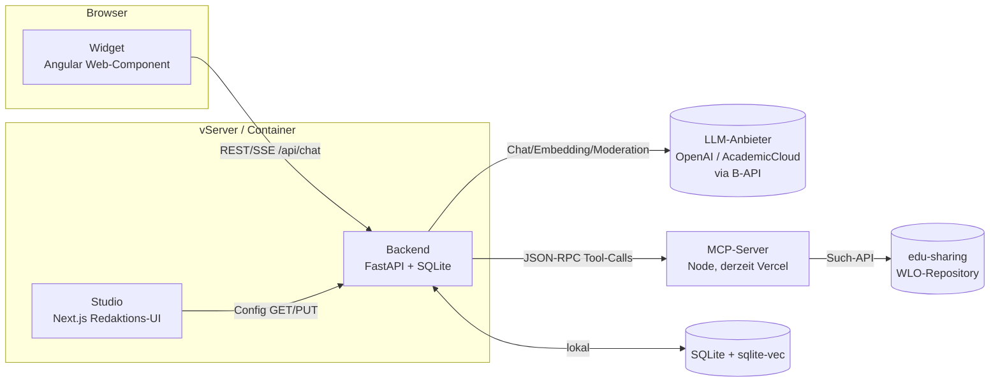

# BadBoerdi — Technische Architektur (intern)

*Interne Präsentations-/Referenzdoku · Stand: 2026-06-15*
*Komponenten, Frameworks, Datenhaltung, Skalierung, Umbau-Optionen*

---

## 1. Systemüberblick — vier Komponenten

| Komponente | Aufgabe | Technik | Ausführung |
|---|---|---|---|
| **Widget (Frontend)** | Chat-UI zum Einbetten in beliebige Seiten | Angular 21 Web-Component | im Browser des Nutzers |
| **Backend** | Kernlogik: Klassifikation, Routing, RAG, Tool-Orchestrierung, Persistenz | FastAPI (Python) | Container auf vServer |
| **Studio** | Redaktions-Oberfläche zum Pflegen aller Config | Next.js (React) | Container/Build, nur intern |
| **MCP-Server** | Such-/Metadaten-Tools ins WLO-Repository | Node (extern, derzeit Vercel) | externer Dienst |

---

## 2. Komponenten im Detail

### 2.1 Backend — das Herzstück (FastAPI / Python)

**Rolle:** Nimmt Chat-Anfragen entgegen, klassifiziert, wählt das Pattern, holt Wissen (RAG) bzw. Material (MCP), erzeugt die Antwort, persistiert die Session.

**Frameworks & Bibliotheken:**
| Lib | Version | Wofür |
|---|---|---|
| `fastapi` | 0.115 | HTTP-API, Routing, Validierung |
| `uvicorn[standard]` | 0.30 | ASGI-Server (Prod-Runtime) |
| `uvloop` | 0.21 | schnellerer Event-Loop (Linux, autom.) |
| `pydantic` | 2.9 | Schemas / Request-Validierung |
| `httpx` | 0.27 | async HTTP-Client (LLM + MCP), Connection-Pools |
| `openai` SDK | ≥1.78 | LLM-Calls (anbieter-agnostisch über base_url) |
| `aiosqlite` + `sqlite-vec` | 0.20 / 0.1.9 | async SQLite **mit Vektorsuche** (RAG) |
| `onnxruntime` | 1.20 | Cross-Encoder-Reranker (CPU, int8) |
| `transformers` | 4.46 | nur Tokenizer für den Reranker (kein Torch) |
| `tiktoken` | 0.7 | Token-Zählung |
| `markitdown` | 0.1 | Datei→Markdown (Upload-Verarbeitung) |
| `pyyaml` / `ruamel.yaml` | 6.0 / — | Config lesen / **kommentar-erhaltend** schreiben |
| `psutil` | 6.1 | CPU/RAM-Sampling (Lasttest) |
| `python-multipart`, `websockets` | — | Uploads, optionale Streams |

**Interne Service-Schichten:** `chat.py` (Orchestrierung) · `llm_service.py` (Prompt-Bau, Klassifikation, Antwort) · `llm_provider.py` (Anbieter-Abstraktion, geteilte Pools) · `rag_service.py` (Embedding-Suche + Reranker) · `mcp_client.py` (JSON-RPC-Tools) · `config_loader.py` (YAML/MD-Config) · `loadtest_service.py` (Selbsttest).

### 2.2 Widget (Frontend) — Angular Web-Component

**Rolle:** Eingebettetes Chat-UI; rendert Antworten, Karten, Inline-Dokumente, Quick-Replies; übermittelt Umgebungs-Kontext.

- **Angular 21**, gebaut mit `@angular/elements` als **Custom Element** → Einbindung per `<script>`-Tag in *jede* Seite (WordPress, Edu-Sharing, Drittsysteme).
- `marked` (Markdown→HTML) + `dompurify` (XSS-Sanitisierung) für sichere Inhalts-Darstellung.
- `rxjs` für Streams; Kommunikation per **REST + Server-Sent-Events** (`/api/chat/stream`) für Live-Status.
- Build-Artefakt ist statisch (`boerdi-widget.js`), wird vom Backend ausgeliefert — **kein** separater Web-Server nötig.

### 2.3 Studio — Redaktions-Oberfläche (Next.js / React)

**Rolle:** Nicht-technische Pflege von Patterns, Intents, Personas, States, Entities, Anzeige-Regeln, Wissensquellen + Auswertung (Sessions, Eval, Lasttest).

- **Next.js 15 / React 18 / TypeScript**; rein internes Werkzeug.
- Spricht das Backend über die **Config-API** an (GET zum Laden, PUT zum Speichern; ruamel sorgt für kommentar-erhaltendes YAML).
- Enthält Spezial-Views: Pattern-/Dimensions-Editoren, Quality/Analyse, Gold-Flow-Eval, **Lasttest mit Grafik**.

### 2.4 MCP-Server — Such-Schicht (extern, Node)

**Rolle:** Stellt die WLO-Suchwerkzeuge bereit (`search_wlo_content`, `…_collections`, `…_topic_pages`, `get_collection_contents`, `get_node_details`, `lookup_wlo_vocabulary`, …).

- **Node-basiert, derzeit als Serverless-Funktion auf Vercel** gehostet; per `MCP_SERVER_URL` umschaltbar.
- Protokoll: **MCP über HTTP/JSON-RPC** (Handshake: initialize → initialized → tools/call), Session-Header.
- Fragt seinerseits das **edu-sharing-Repository** (das eigentliche WLO-Backend) ab — dort entsteht die Hauptlatenz der Suche.

---

## 3. Datenhaltung

### 3.1 Laufzeitdaten — SQLite (eine Datei, lokal)
`aiosqlite` + `sqlite-vec`-Erweiterung. Wichtigste Tabellen:
| Tabelle | Inhalt |
|---|---|
| `sessions` | Chat-Sessions inkl. Tour-Status |
| `messages` | Gesprächsverlauf |
| `memory` | Gesprächs-Gedächtnis pro Session |
| `rag_chunks` | RAG-Wissensschnipsel **+ Vektor-Embeddings** (sqlite-vec) |
| `safety_logs` | Safety-/Moderations-Ereignisse |
| `quality_logs` | Routing-/Qualitäts-Telemetrie |
| `eval_runs` | Eval-/Gold-Flow-Ergebnisse |

→ **Kein DB-Server, kein Cluster** — eine `.db`-Datei genügt; Backups via Datei-Kopie/Cron.

### 3.2 Konfiguration — YAML + Markdown im Repo
Patterns (Markdown mit Frontmatter), Dimensionen (YAML), Anzeige-/Safety-/Tour-Regeln (YAML). Wird beim Start geladen, im Studio editiert, kommentar-erhaltend zurückgeschrieben (`ruamel.yaml`). **Verhalten = Daten, nicht Code.**

---

## 4. Zusammenspiel / Datenflüsse

**Ein Chat-Turn (vereinfacht):**
1. Widget → `POST /api/chat[/stream]` mit Nachricht + Umgebungs-Kontext (Host, Seite, Session-ID).
2. Backend: **Safety/Moderation** (LLM-Anbieter) → **Klassifikation** (LLM) → **Pattern-Wahl**.
3. Je nach Pattern: **RAG** (lokale Vektorsuche + Reranker) *oder* **MCP** (JSON-RPC → edu-sharing) *oder* **LLM-Generierung**.
4. Antwort-Erzeugung (LLM, persona-getönt) → Persistenz in SQLite → Antwort (+ Karten/Inline-Doc) per SSE zurück.

**Querschnitt:** Studio ↔ Backend nur über die Config-API (kein direkter DB-Zugriff). Widget ↔ Backend nur über `/api/*`. Alle externen Aufrufe (LLM, MCP) laufen über **geteilte, gedeckelte httpx-Connection-Pools**.

---

## 5. Skalierbarkeit & Ressourcenverbrauch

### 5.1 Messwerte (Lasttest, 8-Kern-Referenz)
- **Fehlerfrei bis 32 gleichzeitige Zugriffe** (0 Fehler, p95 ≤ 17 s), Durchsatz steigt monoton — reale Decke darüber.
- **RAM:** ~1,5 GB Spitze (Backend-Prozess inkl. Reranker-Modell ~130 MB).
- **CPU:** Hauptlast = **Reranker (ONNX, CPU)**; nach Optimierung Deckel statt Sättigung.

### 5.2 Was limitiert?
1. **CPU-Kerne** (Reranker) → bestimmt die Gleichzeitig-Decke.
2. **Upstream-Latenz** (LLM + MCP/edu-sharing) → bestimmt die *Antwortzeit pro Anfrage* (6–8 s), keine Skalierungsgrenze.
3. RAM / SQLite → unkritisch im getesteten Bereich.

### 5.3 Stellschrauben (alle per Env, ohne Code-Änderung)
- `LLM_MAX_CONCURRENCY` — gleichzeitige LLM-Calls (Bulkhead).
- `MCP_MAX_CONNECTIONS` — Pool zum Suchdienst.
- `RERANK_INTRA_OP_THREADS` / `RERANK_MAX_CONCURRENCY` — Reranker-CPU-Budget.
- `LLM_READ_TIMEOUT` — Abbruch hängender LLM-Calls.
- `RAG_RERANKER_ENABLED` — Reranker auf Mini-Hosts abschaltbar.

### 5.4 Skalierungspfad
**Ein Container** (klein/mittel) → bei höherer Last **mehr uvicorn-Worker / Replikate** hinter einem Reverse-Proxy. *Hinweis:* der In-Memory-Rate-Limiter ist pro Prozess korrekt; bei mehreren Workern wird ein gemeinsamer Zähler (z. B. Redis) oder sticky-Routing nötig.

---

## 6. Umbau-Optionen (Architektur-Weiterentwicklung)

| Option | Was | Nutzen | Aufwand / Hinweis |
|---|---|---|---|
| **MCP als Sidecar** | MCP-Server von Vercel in einen eigenen Container *neben* dem Backend (localhost) | weg von Vercel-Cold-Starts/-Limits; **Suchanfragen verlassen die eigene Infra nicht** (DSGVO); atomares Deployment | teilt CPU/RAM mit Backend → **~+1 Kern, +0,3–0,5 GB** einplanen; `MCP_SERVER_URL` zeigt auf localhost |
| **Andere Datenbank** | SQLite → PostgreSQL (+ pgvector) | echte Mehr-Prozess-/Mehr-Server-Parallelität, zentraler Vektor-Store, robustere Backups | nur nötig bei deutlich höherer Last / Mehr-Worker-Betrieb; Abstraktion über `database.py` |
| **Reranker-CPU senken** | int8-Modell (aktiv) ggf. kleineres CE-Modell, `intra_op`/Pool-Tuning, oder **OpenVINO** auf Intel | weniger CPU pro Anfrage, höhere Gleichzeitig-Decke | Tuning ist gratis; Engine-Wechsel nur nach Messung; auf Mini-Hosts ganz abschaltbar (Embedding-only) |
| **Inhaltssuche über RAG** | falls edu-sharing später **semantische Suche** bietet: Material-Suche teils über Embeddings/RAG statt nur MCP-Keyword | bessere Treffer bei vagen Anfragen, weniger Round-Trips | hängt an Repository-Fähigkeiten; RAG-Schicht ist bereits vorhanden und „anstöpselbar" |
| **Modell-Anbieter wechseln** | OpenAI ↔ AcademicCloud ↔ andere OpenAI-kompatible | Kosten / DSGVO / Verfügbarkeit | bereits per Config; nur `base_url` + Key |

---

## 7. Auf einen Blick (für die interne Folie)

- **Stack:** FastAPI + SQLite/sqlite-vec (Backend) · Angular-Web-Component (Widget) · Next.js (Studio) · externer Node-MCP-Server.
- **Drei externe Abhängigkeiten:** LLM-Anbieter (OpenAI/AcademicCloud via B-API), MCP-Server, edu-sharing-Repository.
- **Datenhaltung:** eine SQLite-Datei (Sessions, RAG-Vektoren, Logs) + Config als YAML/MD im Repo.
- **Skaliert** von 1 Container (≥32 parallel, ~1,5 GB) bis Mehr-Worker/Replikate; Hauptengpass = Reranker-CPU.
- **Erweiterbar** ohne Bruch: MCP-Sidecar, PostgreSQL/pgvector, RAG-gestützte Suche, Anbieterwechsel — alles über klar abgegrenzte Schnittstellen.

---

*Verwandt: Skalierungs-Details → `docs/06-request-pipeline.md` · Deployment → `docs/04-deployment.md` · Fachliche Prinzipien → `docs/grundprinzipien-praesentation.md`.*
