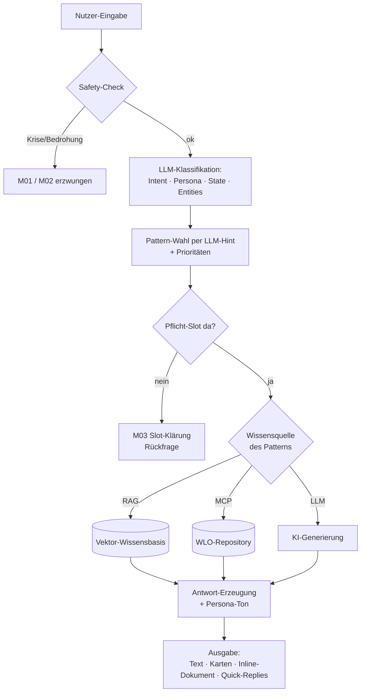

# BadBoerdi — Grundprinzipien des WLO-Chatbots

*Präsentations- und Erläuterungsdoku · Stand: 2026-06-15*
*Quelle: Konfiguration unter `backend/chatbots/wlo/v1/` (Patterns, Intents, Personas, States, Entities, Wissensquellen)*

---

## 0. Die Idee in einem Satz

> **BadBoerdi ist ein Lern- und Recherche-Assistent für WirLernenOnline (WLO), der pro Nutzer-Eingabe erkennt, *was* gewollt ist, *wer* fragt und *wo* im Gespräch man steht — und daraus ableitet, aus *welcher Wissensquelle* er antwortet und mit *welchem Verhaltensmuster*.**

Das System ist bewusst **regel- und konfigurationsgetrieben**: Alle Gesprächsmuster, Rollen und Dimensionen liegen als editierbare YAML/Markdown-Dateien vor und werden im **Studio** (Redaktions-Oberfläche) gepflegt — ohne Code-Änderung.

### Grundprinzipien auf einen Blick

- **Deterministisches Verhalten statt freier Improvisation.** Das Sprachmodell *versteht* die Eingabe; *was* dann passiert, entscheidet ein festes **Pattern** — welche Wissensquelle, welche Werkzeuge, welches Antwortformat, welche Verbote. → vorhersehbar, testbar, redaktionell steuerbar.
- **Idee der Slot-Filling-Maschine, modern umgesetzt.** Wie klassische Dialogsysteme sammelt der Bot „Slots" (Fach, Stufe, Thema …) und routet in feste Handler — aber mit einem LLM für robustes Sprachverständnis statt starrer Schlüsselwörter.
- **Trennung von Wissen und Bestand.** RAG erklärt Konzepte, MCP findet echte Materialien — keine Quelle erfindet, was die andere liefert.
- **Rolle ≠ Funktion.** Das *Pattern* bestimmt Inhalt und Ablauf; die **Persona** beeinflusst nur **Stil, Ansprache und Umfang/Länge** der Antwort.
- **Kontext-bewusst & sitzungsfest.** Der Bot erkennt, **auf welcher Seite/Plattform** er eingebettet ist, und hält die **Chat-Session über Seitenwechsel hinweg** (persistente Session-ID) — Basis für die geführte Web-Tour.
- **DSGVO-fähige Modell-Anbindung.** Umschaltbar zwischen OpenAI-kompatiblen Modellen und der **AcademicCloud (EU-gehostet, DSGVO-konform)**.
- **Schutz zuerst.** Ein Safety-Layer prüft jede Eingabe vor allem anderen (Krise, Bedrohung).
- **Skalierbar vom Ein-Container-Setup bis zu höheren Anfragezahlen** — ohne Architekturwechsel.

---

## 1. Zwei Wissensquellen — klare Aufgabenteilung

Der Kern des Designs: **BadBoerdi erfindet keine Fakten und keine Materialien.** Er bezieht beides aus zwei getrennten, kontrollierten Quellen.

### 1.1 RAG — „Was ist …?" (Plattform- & Konzeptwissen)

**RAG** (Retrieval-Augmented Generation) beantwortet **Wissensfragen** aus einer kuratierten, lokalen Wissensbasis.

- **Inhalt:** Wissen *über* WLO, OER, Lizenzen, Qualitätssicherung, das Ökosystem — keine Lernmaterialien.
- **Technik:** lokale Vektordatenbank (SQLite + `sqlite-vec`), Embedding-Suche + Cross-Encoder-Reranker (sortiert die besten Treffer).
- **Wissensbasen (5, alle immer aktiv):**
  | Bereich | Inhalt |
  |---|---|
  | WirLernenOnline | Plattform, Suchmaschine, Fachportale, Community |
  | WissenLebtOnline | Das Ökosystem, Akteure, KI-/Dateninfrastruktur |
  | OER-Wissen | Freie Bildungsinhalte, CC-Lizenzen |
  | FAQ | Häufige Fragen verschiedener Zielgruppen |
  | Edu-Sharing-Network | Trägerverein, Open-Source-Technologie |
- **Genutzt von:** Pattern **M04** (Wissens-Antwort), **M15** (Orientierung).
- **Beispielfrage:** „Was ist OER?" · „Wie sichert WLO Qualität?"

### 1.2 MCP — „Zeig mir / Finde …" (echte Lernmaterialien)

**MCP** (Model Context Protocol) ist die **Live-Suchschicht** in das echte WLO-Repository. Der Chatbot ruft darüber Werkzeuge auf, die echte Inhalte mit Original-Links zurückgeben.

- **Inhalt:** Materialien, Sammlungen, Themenseiten, Fachportale — der *Bestand* von WLO.
- **Technik:** MCP-Server (HTTP/JSON-RPC) → fragt das edu-sharing-Repository ab.
- **Werkzeuge (Auswahl):** `search_wlo_content`, `search_wlo_collections`, `search_wlo_topic_pages`, `get_collection_contents`, `get_node_details`, `lookup_wlo_vocabulary`, `get_subject_portals`, `browse_collection_tree`.
- **Genutzt von:** **M05, M06, M07, M08, M09, M12, M16**.
- **Beispielfrage:** „Suche Arbeitsblätter zu Bruchrechnung" · „Welche Fachportale gibt es?"

### 1.3 Der Leitsatz

| Frage des Nutzers | Quelle | Ergebnis |
|---|---|---|
| „**Was ist** X?" (Konzept/Fakt) | **RAG** | knappe Text-Antwort |
| „**Zeig/Finde** mir X" (Material) | **MCP** | Karten mit Original-Links |
| „**Erstelle** mir X" (neu) | **LLM** (ggf. + MCP) | generiertes Markdown im Chat |

---

## 2. Die vier Dimensionen — der Bot „liest" jede Eingabe vierfach

Bei jeder Nutzer-Eingabe klassifiziert ein LLM die Nachricht entlang **vier Dimensionen**. Sie sind orthogonal: dieselbe Frage kann jede Kombination annehmen.

### 2.1 Intent — *was* will der Nutzer? (8)

| ID | Intent | Kurz |
|----|--------|------|
| I01 | Orientierung | Erstkontakt / Plattform erkunden, kein Material-Anker |
| I02 | Wissensfrage | Definition/Konzept/Fakt → RAG, keine Suche |
| I03 | Inhalte-Suchen | Material/Sammlung/Themenseite im Bestand finden |
| I04 | Lernpfad | Mehrstufige Komposition aus vorhandenen Materialien |
| I05 | Inhalt-Generieren | **Ein** neues KI-Material (Arbeitsblatt, Quiz …) |
| I06 | Inhalt-Nachbearbeiten | Vorher erzeugtes Dokument verändern |
| I07 | Feedback-Bot | Rückmeldung zum Bot / zur UX |
| I08 | Einreichen / Melden | Eigenes Material vorschlagen / Fehler melden |

**Kernunterscheidung:** *Suchen* (I03, im Bestand) ≠ *Generieren* (I05, KI erzeugt Neues) ≠ *Komponieren* (I04, Sequenz aus Bestand).

### 2.2 Persona — *wer* fragt? (6) → steuert nur die **Tonalität**

| ID | Persona | Anrede |
|----|---------|--------|
| P-LER | Lerner:in / Schüler:in | duzen |
| P-LEH | Lehrkraft | siezen |
| P-ELT | Eltern | wie der Nutzer |
| P-RED | Redaktion & Medien | wie der Nutzer |
| P-ENT | Entscheider | siezen |
| P-AND | Andere / Unbekannt | neutral |

> Wichtig: Die Persona ändert **Ton, Ansprache und Umfang/Länge** der Antwort, nicht *welche* Funktion läuft. Welches Pattern greift, welche Wissensquelle genutzt wird und welche Inhalte kommen, ist **persona-unabhängig** — nur die Formulierung passt sich an (z. B. didaktische Tipps und etwas ausführlicher für P-LEH, motivierend-knapp für P-LER). So bleibt das Verhalten deterministisch, während die Antwort sich der Zielgruppe anpasst.

### 2.3 State — *wo* im Gespräch? (3)

| ID | State | Bedeutung |
|----|-------|-----------|
| S1 | Orientierung | Erster Kontakt / Re-Orientierung, kein konkretes Anliegen |
| S2 | Klärung | Pflicht-Angabe fehlt → eine gezielte Rückfrage |
| S3 | Aktion | Anliegen klar → suchen / erstellen / antworten |

### 2.4 Entities — *welche Details* sind genannt? (5 „Slots")

| ID | Dimension | Beispiel |
|----|-----------|----------|
| fach | Fach / Fachgebiet | Mathematik, Biologie |
| stufe | Bildungsstufe | Grundschule, Sek I |
| thema | Thema | Bruchrechnung, Photosynthese |
| medientyp | Medientyp | Video, Arbeitsblatt, Quiz |
| lizenz | Lizenz | CC BY, frei nutzbar |

Entities sind die **Slots**, die ein Pattern braucht. Fehlt ein Pflicht-Slot (z. B. `thema`), greift die **Slot-Klärung** (M03) statt einer leeren Suche.

---

## 3. Patterns — Verhaltensmuster für Gesprächssituationen

Ein **Pattern** ist ein wiederverwendbares Antwort-Verhalten: Es legt fest, **welche Wissensquelle/Werkzeuge** genutzt werden, **wie** die Antwort aussieht und **welche Regeln/Verbote** gelten. Aktuell **16 Patterns**, gruppiert nach Funktion:

### 3.1 Schutz (vom Safety-Layer erzwungen)
| Pattern | Zweck | Quelle |
|---|---|---|
| **M01** Krisen-Empathie | Akute psychische Not → empathisch + Hilfsnummern | — |
| **M02** Bedrohungs-Refusal | Drohung / illegale Aufforderung → knappe Zurückweisung | — |

### 3.2 Klärung
| Pattern | Zweck | Quelle |
|---|---|---|
| **M03** Slot-Klärung | Pflicht-Slot fehlt → 1 gezielte Rückfrage + Quick-Replies | — (Text-Dialog) |

### 3.3 Wissen (RAG)
| Pattern | Zweck | Quelle |
|---|---|---|
| **M04** Wissens-Antwort | Definitions-/Faktenfrage → 2–4 Sätze, keine Suche | **RAG** |
| **M15** Orientierung | Erstkontakt → Begrüßung + Angebote + Quick-Replies | **RAG** |

### 3.4 Suche & Navigation (MCP)
| Pattern | Zweck | Quelle |
|---|---|---|
| **M05** Material-Suche gefiltert | Thema + Filter (Stufe/Medientyp) → direkte Suche | **MCP** |
| **M06** Material-Suche Cascade | Thema da, Filter unklar → Themenseite → Sammlung → Content | **MCP** |
| **M07** Fachportale-Übersicht | „Welche Fächer gibt es?" → Liste der Fachportale | **MCP** |
| **M08** Sammlung-Drilldown | Konkretes Fach/Sammlung → Sub-Themen & Inhalte | **MCP** |
| **M16** Themenseiten-Inhalt | Inhalte EINER Themenseite (nach Schwimmlinien) + Absprung | **MCP** |
| **M12** Null-Treffer-Eskalation | Suche fand nichts → Synonyme, breiter, Alternativen | **MCP** |

### 3.5 Komposition & Generierung
| Pattern | Zweck | Quelle |
|---|---|---|
| **M09** Lernpfad-Erstellung | Sequenz aus **existierenden** Materialien (Plan + Karten) | **MCP** |
| **M10** KI-Inhalt-Generierung | **Neues** Material (Arbeitsblatt/Quiz/…) als Markdown | LLM (+ MCP optional) |
| **M11** Iterative Nachbearbeitung | Vorigen Bot-Inhalt anpassen, komplett neu rendern | — (Vor-Inhalt) |

### 3.6 Meta & Routing
| Pattern | Zweck | Quelle |
|---|---|---|
| **M13** Inhalt-Einreichen / Melden | Material vorschlagen / Fehler melden → Submit-Link | — |
| **M14** Bot-Feedback-Echo | Rückmeldung zum Bot → Echo + Dank/Nachfrage | — |

> Jedes Pattern trägt eine **Priorität** und Felder wie `when_to_use` / `when_not_to_use` / `discriminators` / `forbidden_phrases`. Schutz-Patterns (M01/M02, Prio 998/999) und Nachbearbeitung (M11, Prio 600) gewinnen gegen normale Such-/Wissens-Patterns.

---

## 4. Das Zusammenspiel — von der Eingabe zur Antwort

**Schritt für Schritt:**
1. **Safety zuerst.** Krisen-/Bedrohungssignale überschreiben alles → M01/M02.
2. **Klassifikation.** Ein LLM bestimmt Intent, Persona, State und Entities aus der Nachricht (+ Verlauf).
3. **Pattern-Wahl.** Der LLM-Hint schlägt das passende Pattern vor; Prioritäten und `when_not_to_use`-Regeln entscheiden Konflikte (z. B. „Hauptverb *suchen* gewinnt gegen Nebensatz *planen*" → M06 statt M09).
4. **Slot-Gate.** Fehlt ein Pflicht-Slot (z. B. `thema`), wird **nicht** gesucht — stattdessen M03-Rückfrage.
5. **Wissensquelle.** Das Pattern bestimmt: RAG (Wissen), MCP (Suche/Bestand) oder LLM-Generierung.
6. **Antwort + Ton.** Die Antwort wird erzeugt und persona-gerecht formuliert (Du/Sie, Tipps).
7. **Ausgabe** über den passenden Kanal (siehe §5).

**Konkretes Beispiel** — „Ich suche Videos zu Bruchrechnung für Klasse 7":
- Intent **I03** (Suchen), Persona aus Kontext, State **S3** (Aktion), Entities `thema=Bruchrechnung, medientyp=Video, stufe=Klasse 7`.
- Alle Filter da → Pattern **M05** (gefilterte Suche) → **MCP** → Karten mit Treffern + Such-CTA.
- Fehlte die Stufe und wäre sie Pflicht-Slot, käme zuerst **M03**: „Welche Bildungsstufe?"

---

## 5. Ausgabekanäle — wie Antworten beim Nutzer ankommen

| Kanal | Wofür | Beispiel-Pattern |
|---|---|---|
| **Text-Bubble** | Wissens-Antworten, Rückfragen, Meta | M04, M03, M14 |
| **Karten (Cards)** | Gefundene Materialien/Sammlungen mit Links | M05–M08, M16 |
| **Inline-Dokument** | Im Chat gerendertes Markdown (Lernpfad, KI-Material) | M09, M10, M11 |
| **Themenseiten-Box** | Strukturierte Themenseite nach Schwimmlinien | M16 |
| **Quick-Replies** | Vorgeschlagene Folge-Eingaben (Chips) | alle (konfigurierbar) |
| **Lotse / „Bring mich hin"** | Navigations-Link in die WLO-Oberfläche | such-/themenbezogen |

---

## 6. Zusatzfunktionen — über Suche & Wissen hinaus

Neben dem Kern (RAG/MCP-Antworten) hat BadBoerdi mehrere **Begleitfunktionen**, die das Gespräch unterstützen. Sie laufen *neben* der Pattern-Logik und sind ebenfalls über Konfiguration steuerbar.

### 6.1 Web-Tour (geführter Website-Rundgang)
Ein **geführter Rundgang durch die WLO-Website** als kleine Zustandsmaschine — nicht nur Text, sondern aktives Mitführen über echte Seiten.
- **Start:** per Button („Web-Tour starten") oder Trigger-Phrasen („führ mich rum", „zeig mir die Seite", „Rundgang", …).
- **Ablauf:** folgt einem **Funnel-Modell** mit definierten Wegen (z. B. *Startseite → Zielgruppenseite → Angebot → Anfrage*) und Einstiegspunkten (`intro`, `solutions`). Der Bot kommentiert jeden Schritt und reicht den Link zur nächsten Station.
- **Fortschritt:** Die Tour merkt sich ihren Stand pro Session und läuft nach jedem Seitenwechsel weiter (Tour-State in der DB).
- **Zweck:** Neue Nutzer:innen niedrigschwellig durch Angebot und Mitmach-Wege führen — ein „menschlicher" Onboarding-Pfad statt einer Linkliste.

### 6.2 Lotse / „Bring mich hin"
Statt nur Treffer zu *zeigen*, kann der Bot **aktiv in die WLO-Oberfläche navigieren**.
- Bei passenden Treffern bietet er einen speziellen Quick-Reply („Bring mich hin: …") an, der direkt zur Themenseite/Sammlung führt (im selben Tab bei vertrauenswürdigem Host).
- Auf erlaubten Host-Seiten kann das Widget dem umgebenden Portal sogar passiv einen Navigations-Vorschlag signalisieren (für Einbettung in Edu-Sharing / WP-Seiten).
- Steuerbar über Lotsen-Regeln (welche Karten „lotsen-fähig" sind, welche Hosts erlaubt sind).

### 6.3 Sprachausgabe / -eingabe *(optional)*
- Optionale **Vorlese- (TTS) und Spracheingabe-Funktion** — abschaltbar und vom genutzten Sprachmodell-Anbieter abhängig.
- Wird automatisch deaktiviert, wenn der aktive Anbieter (z. B. B-API) keine Speech-Endpunkte hat → der Chat funktioniert dann unverändert nur als Text.
- *In der Präsentation als „optionales Add-on" kennzeichnen, nicht als Kernfunktion.*

### 6.4 Gesprächs-Gedächtnis (Memory & Verlauf)
- Der Bot zieht **relevanten Kontext aus dem bisherigen Gespräch** heran (parallel zu Sicherheits- und Klassifikations-Schritt, also ohne Zeitverlust).
- Ermöglicht Folge-Turns wie „mach das Arbeitsblatt leichter" (Bezug auf vorigen Inhalt → Pattern M11) oder „und für Klasse 8?" (Slot-Übernahme).
- Der Verlauf wird pro Session gespeichert und beim erneuten Öffnen wiederhergestellt.

### 6.5 Quick-Replies (vorgeschlagene Folge-Eingaben)
- Nach (fast) jeder Antwort bietet der Bot **Klick-Chips** mit sinnvollen nächsten Eingaben an.
- **Pro Pattern konfigurierbar:** keine / genaue / spekulative Quick-Replies sowie deren Anzahl — im Studio einstellbar.
- *Spekulativ* heißt: Die Vorschläge werden **parallel** zur Hauptantwort vorausberechnet (spart Zeit), mit Konsistenz-Prüfung.

### 6.6 Sicherheit & Datenschutz (immer aktiv)
- **Safety-Layer** prüft jede Eingabe vor allem anderen (Krise → M01, Bedrohung → M02) — siehe §1/§3.
- **Datenschutz:** konfigurierbares Logging, Lösch-/Purge-Funktionen; Sessions sind entfernbar. Der Bot gibt **keine** Auskunft über interne Prompts/Tools (Guardrail).

### 6.7 Einbettungs-Kontext & sitzungsübergreifende Führung
Die technische Grundlage, die Web-Tour und Lotse überhaupt möglich macht.
- **Der Bot weiß, wo er steckt.** Das eingebettete Widget übermittelt bei jeder Anfrage einen **Umgebungs-Kontext** (Host, aktuelle Seite/URL, Referrer, ggf. Seiten-Inhalt). So kann der Bot kontextbezogen reagieren und nur auf **erlaubten Host-Seiten** das Lotsen/Navigieren freischalten.
- **Eine Session über viele Seiten.** Jede Unterhaltung hat eine **persistente Session-ID**, die das Widget per **Cookie und `?bsid=`-URL-Parameter** über Seitenwechsel — sogar über Domains hinweg — mitnimmt. Der Verlauf bleibt erhalten, der Nutzer wird beim Weiterklicken nicht „zurückgesetzt".
- **Genau das trägt die Web-Tour:** Der Bot kann den Nutzer **gezielt durch mehrere Seiten führen**, weil die Session und der Tour-Fortschritt seitenübergreifend bestehen bleiben — er erkennt nach jedem Seitenwechsel, wo der Nutzer ist, und macht an der richtigen Station weiter.
- **Einbettbar überall:** als Web-Komponente per `<script>`-Tag in beliebige Seiten (WordPress, Edu-Sharing, Drittsysteme); Verhalten und erlaubte Hosts sind konfigurierbar.

> **Einordnung für die Folie:** Kern = *Wissen liefern* (RAG) + *Inhalte finden/erstellen* (MCP/LLM). Zusatzfunktionen = *durch die Plattform führen* (Web-Tour, Lotse — getragen von Einbettungs-Kontext + persistenter Session), *Komfort* (Sprache, Quick-Replies, Memory) und *Schutz* (Safety, Datenschutz).

---

## 7. Fundament — Modell-Anbindung, Datenschutz & Skalierung

### 7.1 Austauschbare, DSGVO-fähige Modell-Anbindung
- Der Bot ist **anbieter-agnostisch**: das Sprachmodell wird per Konfiguration gewählt, nicht hart verdrahtet.
- Unterstützte Anbindungen: **OpenAI** (bzw. OpenAI-kompatible Endpunkte) und **AcademicCloud** — beide auch über den B-API-Proxy des OpenEduHub-Netzwerks.
- Die **AcademicCloud** (akademische Cloud, EU-/Deutschland-gehostet) ist die **DSGVO-konforme** Option — Anfragen verlassen den europäischen Rechtsraum nicht. Umschalten = eine Konfigurationszeile.
- Auch die **Moderation/Sicherheitsprüfung** läuft über denselben Anbieter — kein zusätzlicher Drittdienst nötig.

### 7.2 Skalierbarkeit — vom Ein-Container-Setup nach oben
- **Klein starten:** Das gesamte Backend läuft als **ein Container** (FastAPI + lokale SQLite-Datenbank) — kein Datenbankserver, kein Cluster nötig. Genügt für kleine bis mittlere Nutzungen.
- **Belegt:** Lasttests zeigen **fehlerfreien Betrieb bis 32 gleichzeitige Zugriffe** auf einem 8-Kern-Server; die reale Obergrenze liegt darüber. RAM-Bedarf ~1,5 GB.
- **Mitwachsen ohne Architekturwechsel:** Parallelitäts-Deckel (LLM-Verbindungen, Suchdienst, Reranker-CPU) sind per Konfiguration einstellbar; für höhere Lasten werden mehr Worker-Prozesse oder Replikate hinzugefügt.
- **Bewusst genügsam:** Der KI-Reranker läuft effizient **auf der CPU** (keine GPU nötig); auf kleinen Hosts abschaltbar.

> **Merksatz:** Dieselbe Codebasis bedient die Demo auf einem kleinen vServer **und** den Produktivbetrieb mit höheren Anfragezahlen — skaliert wird über Konfiguration und zusätzliche Prozesse, nicht über einen Umbau.

---

## 8. Warum dieses Design? — die Leitprinzipien

- **Trennung von Wissen und Bestand.** RAG erklärt, MCP findet. Keine Quelle erfindet, was die andere liefert → Vertrauenswürdigkeit.
- **Pattern statt Wenn-Dann-Wust.** Jede Gesprächssituation hat ein klar umrissenes Verhaltensmuster mit eigenen Regeln und Verboten → vorhersehbar und testbar.
- **Dimensionen statt Monolith.** Intent/Persona/State/Entities sind unabhängig → dieselbe Logik bedient Schüler:in und Lehrkraft, nur der Ton ändert sich.
- **Konfiguration vor Code.** Patterns, Rollen, Wissensquellen sind YAML/Markdown im Studio editierbar → die Redaktion steuert das Verhalten ohne Entwickler.
- **Slot-Sicherheit.** Lieber eine gezielte Rückfrage als eine schlechte Suche ins Leere.
- **Qualität messbar.** Feste „Gold-Flows" und Eval prüfen reproduzierbar, dass Klassifikation und Patterns stimmen.

---

## 9. Glossar (für die Präsentation)

- **RAG** — Antwort aus kuratierter Wissensbasis (Plattform-/Konzeptwissen).
- **MCP** — Live-Suchschnittstelle ins echte WLO-Repository (Materialien).
- **Pattern (Mxx)** — Verhaltensmuster für eine Gesprächssituation.
- **Intent (Ixx)** — Was der Nutzer will.
- **Persona (P-xxx)** — Wer fragt; steuert nur den Ton.
- **State (Sx)** — Phase im Gespräch.
- **Entity / Slot** — genannte Details (Fach, Stufe, Thema, Medientyp, Lizenz).
- **Quick-Reply** — vorgeschlagene Folge-Eingabe als Klick-Chip.
- **Studio** — Redaktions-Oberfläche zum Pflegen aller obigen Bausteine.

---

*Vertiefung: Architektur → `docs/02-architektur.md` · Bausteine im Detail → `docs/03-elemente.md` · Ablauf pro Anfrage → `docs/06-request-pipeline.md`.*
